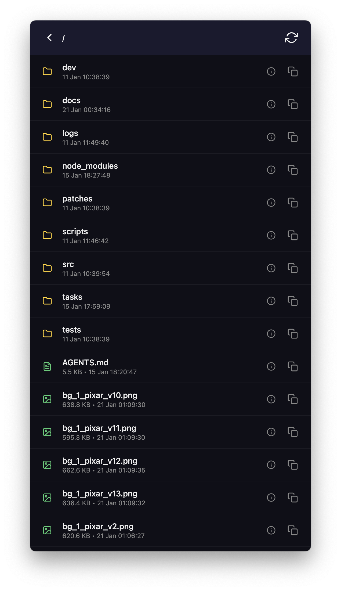
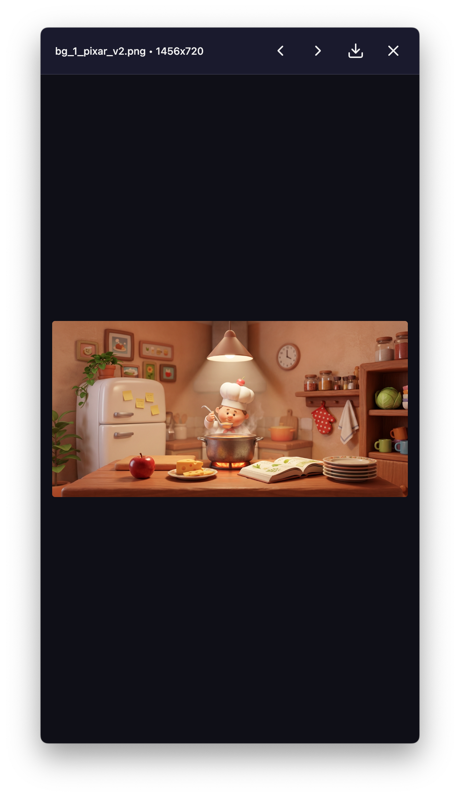
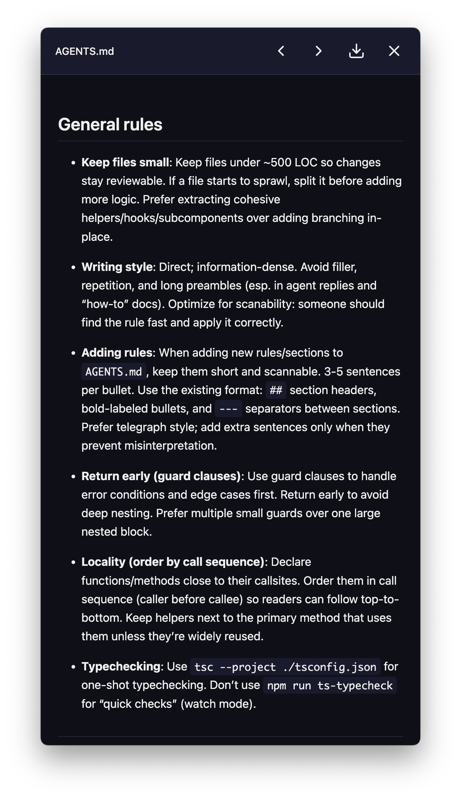

# Browsey

A mobile-friendly web file browser CLI tool built with Bun.

Start a local web server to browse files from any device on your network - perfect for quickly accessing files on your computer from your phone or tablet.

<div>
  
  
  
</div>

## Features

- **Mobile-first UI** - Touch-friendly interface with large tap targets
- **Dark theme** - Easy on the eyes
- **Copy path** - One-tap copy of absolute file paths
- **Ignore patterns** - Filter out files/folders with glob patterns
- **QR code** - Scan to open on mobile instantly
- **Zero config** - Just run `browsey` and go

## PWA Install

Browsey is installable as a PWA when served over HTTPS (or localhost). If you want Add to Home Screen on a remote device, put Browsey behind a TLS-terminating reverse proxy.

## Quick Start

Run directly with `bunx` — no installation needed:

```bash
bunx browsey start .
```

Or install globally:

```bash
bun install -g browsey
browsey start .
```

## Usage

```bash
# Serve current directory
browsey start

# Serve a specific directory
browsey start ./photos

# Custom ports
browsey start -p 3000 --app-port 3001

# Open browser automatically
browsey start --open

# Allow file modifications (default is read-only)
browsey start --no-readonly

# Ignore patterns
browsey start -i "node_modules,.git,*.log"

# Show hidden files
browsey start --hidden

# All options
browsey start ./my-folder -p 4200 --app-port 4201 -i "node_modules,.git" --hidden --open --no-readonly --no-qr
```

All commands work with `bunx browsey` too:

```bash
bunx browsey start ./photos --open
```

## Options

| Option | Description | Default |
|--------|-------------|---------|
| `[path]` | Directory to serve | `.` (current) |
| `-p, --port <port>` | Port number | `4200` |
| `-h, --host <host>` | Host to bind | `0.0.0.0` |
| `-i, --ignore <globs>` | Comma-separated ignore patterns | - |
| `--open` | Open browser automatically | `false` |
| `--no-readonly` | Allow file modifications | `false` |
| `--hidden` | Show hidden files | `false` |
| `--no-qr` | Do not display QR code | `false` |
| `--no-https` | Disable HTTPS | - |
| `--https-cert <path>` | Path to TLS certificate (PEM) | `./certs/browsey.pem` |
| `--https-key <path>` | Path to TLS private key (PEM) | `./certs/browsey-key.pem` |

## API

Browsey exposes a simple REST API:

| Endpoint | Description |
|----------|-------------|
| `GET /api/list?path=/` | List directory contents |
| `GET /api/file?path=/file.txt` | Download a file |
| `GET /api/stat?path=/file.txt` | Get file metadata |

### Response format

`GET /api/list?path=/`

```json
{
  "path": "/",
  "items": [
    {
      "name": "documents",
      "type": "directory",
      "size": 4096,
      "modified": "2024-01-15T10:30:00.000Z",
      "extension": null
    },
    {
      "name": "photo.jpg",
      "type": "file",
      "size": 245678,
      "modified": "2024-01-14T08:20:00.000Z",
      "extension": "jpg"
    }
  ]
}
```

## Development

```bash
# Clone the repo
git clone https://github.com/vforsh/browsey.git
cd browsey

# Install dependencies
bun install

# Run in dev mode
bun run dev

# Build
bun run build

# Link locally for testing
bun link
```

## Tech Stack

- **Bun** - Runtime, bundler, and package manager
- **TypeScript** - Type safety
- **Bun.serve** - Native HTTP server
- **Bun.Glob** - Pattern matching
- **Commander.js** - CLI argument parsing
