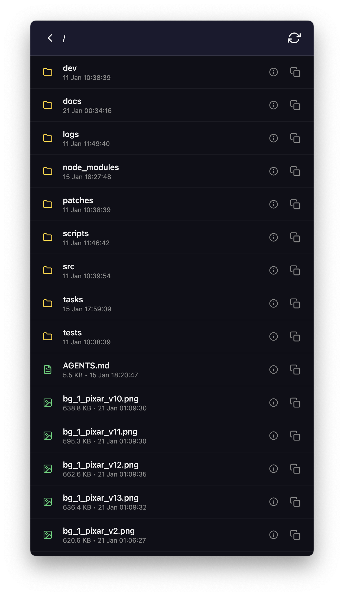
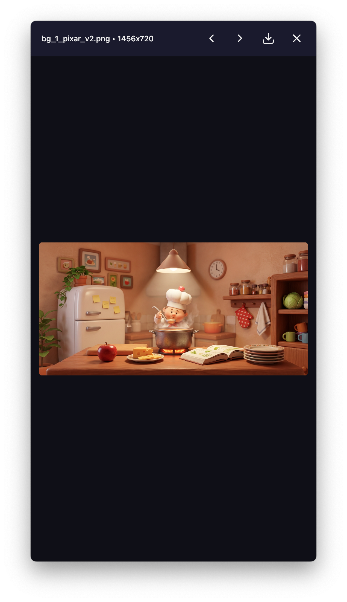
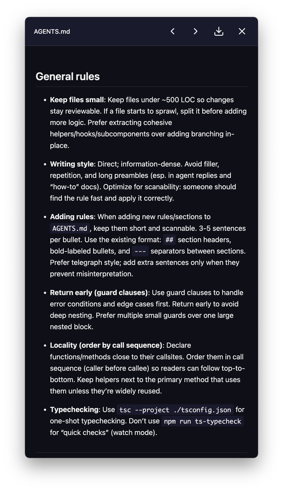

# Browsey

A mobile-friendly web file browser CLI tool built with Bun.

Start a local web server to browse files from any device on your network - perfect for quickly accessing files on your computer from your phone or tablet.

<div>
  
  
  
</div>

## Features

- **Mobile-first UI** - Touch-friendly interface with large tap targets
- **Dark theme** - Easy on the eyes
- **Copy path** - One-tap copy of absolute file paths
- **Ignore patterns** - Filter out files/folders with glob patterns
- **QR code** - Scan to open on mobile instantly
- **Bonjour discovery** - API advertises itself on local network (`_browsey._tcp`)
- **Zero config** - Just run `browsey` and go

## PWA Install

Browsey is installable as a PWA when served over HTTPS (or localhost). If you want Add to Home Screen on a remote device, put Browsey behind a TLS-terminating reverse proxy.

## Quick Start

Run directly with `bunx` — no installation needed:

```bash
bunx browsey start .
```

Or install globally:

```bash
bun install -g browsey
browsey start .
```

## Usage

```bash
# Serve current directory
browsey start

# Serve a specific directory
browsey start ./photos

# Custom ports
browsey start -p 3000 --app-port 3001

# Open browser automatically
browsey start --open

# Allow file modifications (default is read-only)
browsey start --no-readonly

# Ignore patterns
browsey start -i "node_modules,.git,*.log"

# Show hidden files
browsey start --hidden

# All options
browsey start ./my-folder -p 4200 --app-port 4201 -i "node_modules,.git" --hidden --open --no-readonly --no-qr
```

All commands work with `bunx browsey` too:

```bash
bunx browsey start ./photos --open
```

## Options

| Option | Description | Default |
|--------|-------------|---------|
| `[path]` | Directory to serve | `.` (current) |
| `-p, --port <port>` | Port number | `4200` |
| `-h, --host <host>` | Host to bind | `0.0.0.0` |
| `-i, --ignore <globs>` | Comma-separated ignore patterns | - |
| `--open` | Open browser automatically | `false` |
| `--no-readonly` | Allow file modifications | `false` |
| `--hidden` | Show hidden files | `false` |
| `--no-qr` | Do not display QR code | `false` |
| `--no-bonjour` | Disable Bonjour/mDNS API advertisement | `false` |
| `--no-https` | Disable HTTPS | - |
| `--https-cert <path>` | Path to TLS certificate (PEM) | `./certs/browsey.pem` |
| `--https-key <path>` | Path to TLS private key (PEM) | `./certs/browsey-key.pem` |
| `--no-agents` | Disable the agent thread launch endpoints | `false` (agents on) |
| `--agents-token <token>` | Use this agent token instead of the persisted one | - |

## API

Browsey exposes a simple REST API:

| Endpoint | Description |
|----------|-------------|
| `GET /api/list?path=/` | List directory contents |
| `GET /api/sync/manifest?path=/&revision=<sha256>` | Recursively snapshot a tree for offline sync; matching revisions return `unchanged: true` |
| `GET /api/file?path=/file.txt` | Download a file |
| `GET /api/view?path=/file.txt` | View text, images, and supported videos |
| `GET /api/stat?path=/file.txt` | Get file metadata |
| `POST /api/save` | Save an existing text file; requires read-write mode and `baseModified`/`baseSize` conflict guards |
| `GET /api/git/changes?path=/` | Git file changes |
| `GET /api/git/commit?path=/&hash=<sha>` | Git commit details, stats, navigation, and changed files (`includeAdjacent=0` skips navigation lookup) |
| `POST /api/git/revert` | Discard changes for one git file |
| `GET /api/agents?path=/` | Agent capabilities: installed CLIs, model lists and live sessions; `path` adds the working directory a launch would resolve to (**bearer token required**) |
| `POST /api/agents/launch` | Start a Codex thread, or open a Claude session (**bearer token required**) |
| `POST /api/agents/stop` | End a live Claude session (**bearer token required**) |

### Response format

`GET /api/list?path=/`

```json
{
  "path": "/",
  "items": [
    {
      "name": "documents",
      "type": "directory",
      "size": 4096,
      "modified": "2024-01-15T10:30:00.000Z",
      "extension": null
    },
    {
      "name": "photo.jpg",
      "type": "file",
      "size": 245678,
      "modified": "2024-01-14T08:20:00.000Z",
      "extension": "jpg"
    }
  ]
}
```

## Agent threads

Browsey can put an agent to work on this machine from a paired mobile app. The two agents
behave differently, because the apps you pick the work up in do.

- **[Codex](https://developers.openai.com/codex/cli)** takes a prompt together with the
  folder, file or excerpt you launched from, runs it, and is forgotten. Browsey answers as
  soon as the thread exists; the result is waiting for you in the Codex app, or under
  `codex resume`.
- **[Claude Code](https://docs.claude.com/en/docs/claude-code)** opens a live Remote Control
  session in a directory and answers with a link that opens *that* session in the Claude
  phone app, which is where the conversation then happens. The prompt is optional: given
  one, the session starts on it immediately; left blank, it opens idle and waits for you to
  say something. Either way the session stays up until you stop it, and survives a browsey
  restart.

Agent endpoints are **enabled by default** and always require a bearer token.

```bash
browsey pair              # print the token and a pairing QR code
browsey start --no-agents # or turn the endpoints off entirely
```

- **Token**: generated once, stored at `~/.browsey/agent-token` with mode `0600`, reused
  across restarts. `--agents-token` overrides it for one run without persisting.
- **Not gated by `readonly`**: `--no-readonly` protects Browsey's *own* file mutations.
  Agents have their own opt-in (`--no-agents`) plus the token, so the two are independent.
- **Full access**: Claude sessions run with `--permission-mode bypassPermissions`; Codex is
  driven over the app-server protocol with `sandbox: danger-full-access` and
  `approvalPolicy: never` — equivalent to `--dangerously-bypass-approvals-and-sandbox`, and
  recorded in a way the Codex apps list. Anyone holding the token can run arbitrary code on
  the machine — treat it like an SSH key.
- **cwd**: resolved to the nearest agent project already known to the CLI, else the git
  root, else the target folder — so threads land in real projects and reuse their history.
- **Live sessions**: `GET /api/agents` lists the Claude ones, read from Claude's own state
  directory and filtered by whether the process is still alive — so a session started before
  the last browsey restart is still listed and still stoppable. `POST /api/agents/stop` ends
  one by `sessionId`.
- **Logs**: stdout/stderr of each run goes to `~/.browsey/agent-runs/<timestamp>-<agent>.log`
  (debugging only, no rotation yet).
- **Failures**: a Codex launch answers before the run finishes, so if that thread dies
  afterwards the reason is remembered and reported as `lastFailure` on the next
  `GET /api/agents` — which is how the app can tell you "your login expired" instead of
  silently producing threads that never ran. A Claude session is different: it either
  registers within a second or the launch fails outright.
- **Binary resolution**: `BROWSEY_CLAUDE_BIN` / `BROWSEY_CODEX_BIN`, then `~/.local/bin/claude`
  and `/opt/homebrew/bin/codex`, then `PATH` (augmented with those two directories, which
  matters for the launchd-managed instance). Claude additionally needs a controlling
  terminal, which comes from `script(1)` — no native pty module is involved.

## Development

```bash
# Clone the repo
git clone https://github.com/vforsh/browsey.git
cd browsey

# Install dependencies
bun install

# Run in dev mode
bun run dev

# Build
bun run build

# Link locally for testing
bun link
```

## Tech Stack

- **Bun** - Runtime, bundler, and package manager
- **TypeScript** - Type safety
- **Bun.serve** - Native HTTP server
- **Bun.Glob** - Pattern matching
- **Commander.js** - CLI argument parsing
